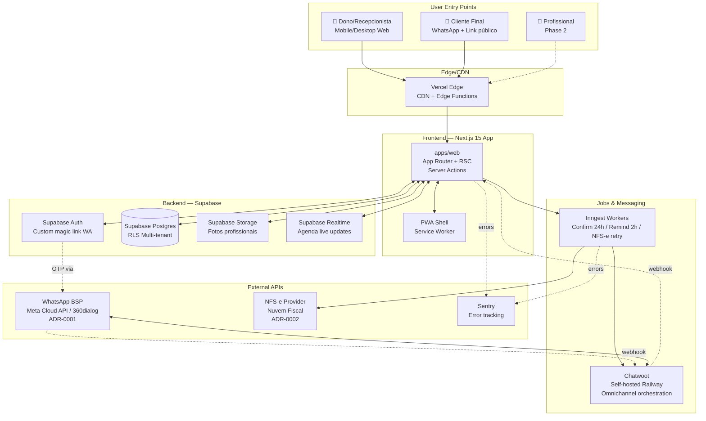
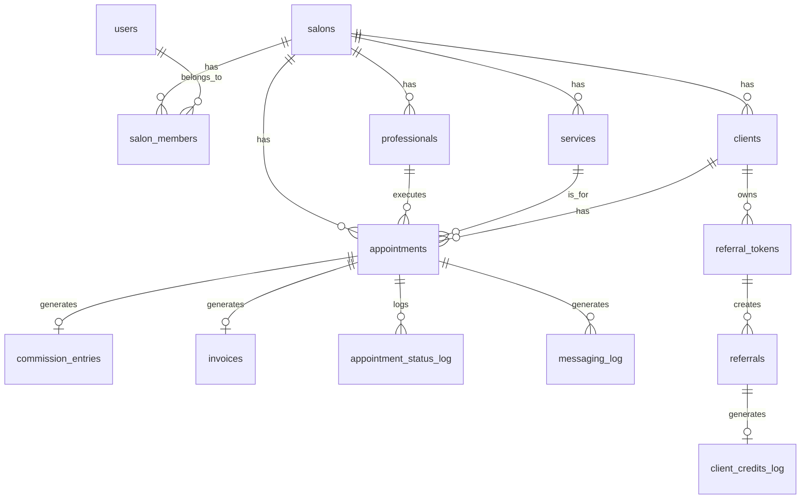
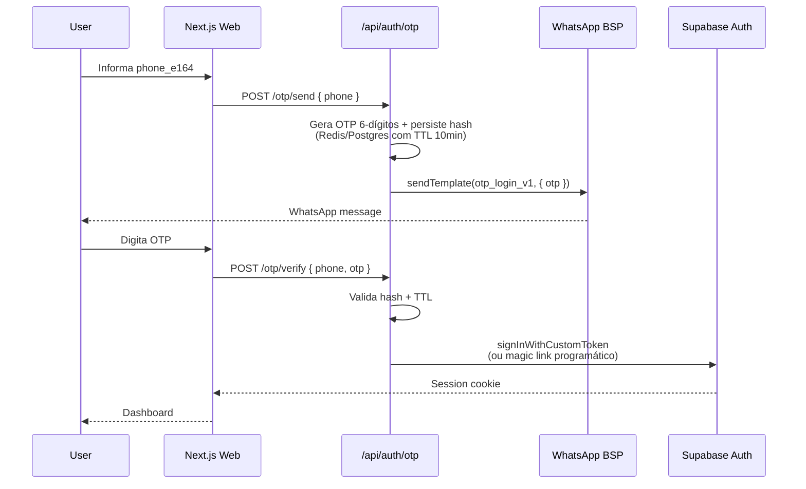
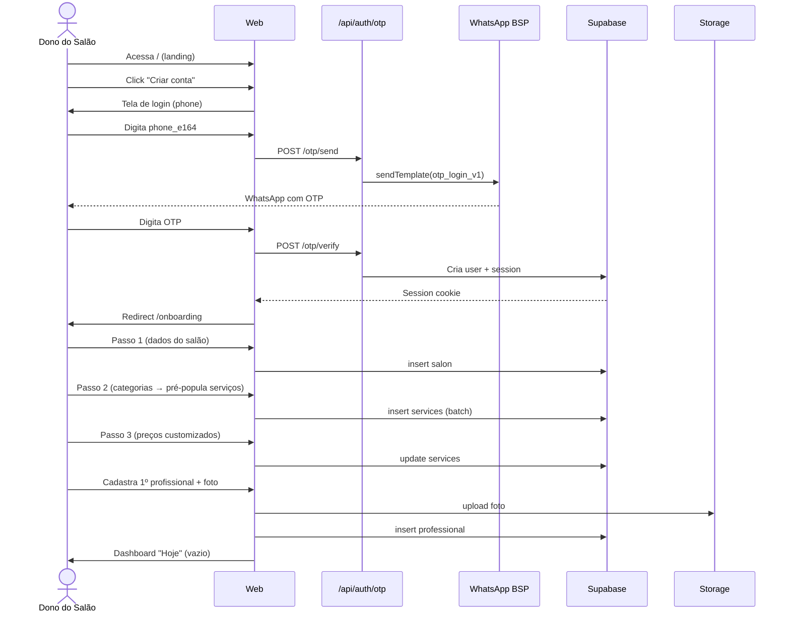
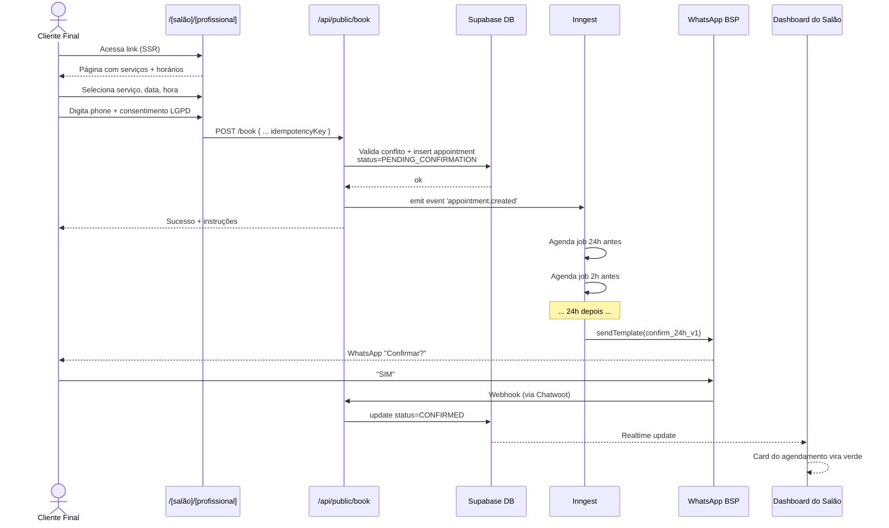
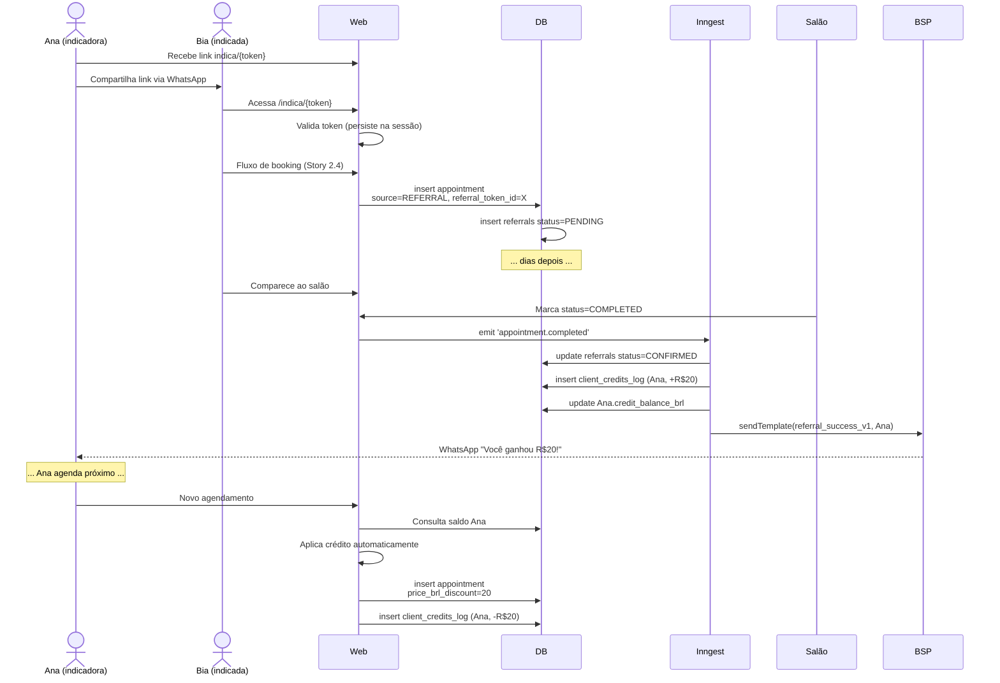

# SoftHair Fullstack Architecture Document

**Versão:** 1.2 (SCOPE CHANGE — WhatsApp + NFS-e movidos para Phase 2)

> ⚠️ **SCOPE CHANGE — 2026-04-21:** ADR-0001 (WhatsApp) e ADR-0002 (NFS-e) foram **diferidos para Phase 2**. Chatwoot removido do stack MVP. Auth mudou para email magic link (Supabase nativo). Ver [docs/change-records/2026-04-21-mvp-scope-reduction.md](./change-records/2026-04-21-mvp-scope-reduction.md).
**Data:** 2026-04-20
**Autor:** Aria (Architect Agent)
**Status:** Draft para review do founder; ADRs marcados "to verify" precisam validação
**Input:** `docs/prd.md` v1.0 + `docs/brief.md` v1.0
**Delegação:** schema DDL detalhado → @data-engineer (Dara); design system detalhado → @ux-design-expert (Uma)

---

## Introduction

Este documento descreve a arquitetura fullstack completa de **SoftHair**, unificando decisões de backend, frontend e infraestrutura. Serve como a única fonte de verdade para o desenvolvimento assistido por AI (stack AIOX), garantindo consistência através de toda a pilha tecnológica.

A arquitetura é deliberadamente **conservadora e pragmática** — otimizada para velocidade de execução de founder solo + agentes AI em 3 meses, baixo custo operacional (R$ 500-1.500/mês no MVP), e compliance LGPD + WhatsApp ToS. Escolhas "boring" (Next.js, Supabase, Postgres) dominam; escolhas "exciting" (IA para voice booking, preço dinâmico) são explicitamente Phase 2/3.

### Starter Template or Existing Project

**N/A — Greenfield project.**

Não usaremos starter template externo para preservar controle total da arquitetura. O scaffold de Story 1.1 estabelece a estrutura Turborepo customizada mapeada neste documento.

### Change Log

| Date | Version | Description | Author |
|---|---|---|---|
| 2026-04-20 | 1.0 | Draft inicial derivado do PRD v1.0 | Aria (Architect) |
| 2026-04-20 | 1.1 | ADR-0001 (Meta Cloud API) e ADR-0002 (Nuvem Fiscal) movidos de PROPOSED para ACCEPTED conforme decisão do founder | Aria (Architect) |

---

## High Level Architecture

### Technical Summary

SoftHair adota arquitetura **monolítica modular em Next.js 15 com Server Actions + RSC**, hospedado em Vercel, integrado a Supabase (Postgres + Auth + Storage + Realtime) como backend-as-a-service primário. A camada de mensageria é implementada via **Chatwoot self-hosted** (orquestração omnichannel) + **WhatsApp Business API oficial** (por BSP a definir em ADR-0001). Jobs agendados (confirmações, lembretes, retries NFS-e) executam em **Inngest** (serverless, event-driven). Monorepo **Turborepo** organiza `apps/web`, `apps/workers`, `packages/db`, `packages/ui` e `packages/messaging`. Multi-tenancy é garantida por **Row-Level Security (RLS)** no Postgres, isolando dados por `salon_id` a nível de banco. Essa arquitetura atinge as metas do PRD equilibrando custo baixo, velocidade de desenvolvimento, e extensibilidade para as Phases 2/3.

### Platform and Infrastructure Choice

**Platform:** Vercel (frontend/API) + Supabase Cloud (DB/Auth/Storage/Realtime) + Railway (Chatwoot self-hosted) + Inngest (jobs)

**Key Services:**
- Vercel — Next.js hosting, Edge Functions, preview deploys, Analytics
- Supabase — Postgres 15, Auth (customizado para magic link WhatsApp), Storage (fotos de profissionais), Realtime (atualização da agenda)
- Railway — Chatwoot (container Docker + Postgres dedicado)
- Inngest — agenda e executa jobs serverless (confirmações 24h, lembretes 2h, retries NFS-e)
- WhatsApp BSP (Meta Cloud API direto OU 360dialog — ADR-0001)
- NFS-e Provider (Nuvem Fiscal recomendado — ADR-0002)
- Sentry — error tracking
- PostHog — product analytics (opcional no MVP)

**Deployment Host and Regions:**
- Vercel: região `gru1` (São Paulo) + edge global
- Supabase: região `sa-east-1` (São Paulo)
- Railway: região `us-east-1` inicialmente (migrar para BR se latência impactar; Chatwoot é async, menos crítico)
- Inngest: serverless (sem região específica)

**Rationale da plataforma:**

Três opções consideradas:

| Opção | Prós | Contras | Veredito |
|---|---|---|---|
| **Vercel + Supabase** (escolhida) | DX excelente, custo previsível, setup <1h, auth pronto, realtime nativo | Lock-in moderado (mitigável via Postgres portável) | ✅ Ideal para MVP solo + velocidade |
| **AWS Full Stack** | Escala infinita, controle total | Overhead de infra pesado para 1 dev; custo variável alto | ❌ Over-engineering para 20 salões |
| **Railway/Fly.io + Postgres próprio** | Flexibilidade máxima | Sem auth/storage prontos; rebuild de features já existentes | ❌ Reinvention wheel |

### Repository Structure

**Structure:** Monorepo
**Monorepo Tool:** Turborepo 2.x + pnpm workspaces
**Package Organization:**

```
project-squad/
├── apps/
│   ├── web/           # Next.js 15 (App Router, RSC, Server Actions)
│   └── workers/       # Inngest functions (jobs agendados)
├── packages/
│   ├── db/            # Supabase schema, migrations, types gerados
│   ├── ui/            # shadcn/ui customizado + tokens
│   ├── messaging/     # Wrapper Chatwoot + WhatsApp BSP + NFS-e
│   ├── core/          # Domain logic compartilhada (commission engine, referral engine)
│   └── config/        # ESLint, TS, Tailwind configs compartilhados
├── docs/              # PRD, architecture, stories, ADRs
├── .aiox-core/        # Framework AIOX (agentes AI)
├── turbo.json
├── pnpm-workspace.yaml
└── package.json
```

**Rationale:** Monorepo reduz overhead para founder solo (compartilhamento de types TypeScript entre web e workers sem publicação de packages), simplifica CI/CD (um único pipeline), e habilita `packages/core` com lógica de domínio isolada e testável (commission engine, referral engine).

### High Level Architecture Diagram



### Architectural Patterns

- **Modular Monolith (Next.js):** Um único app Next.js com domínios isolados em `packages/core` (booking, commission, referral, messaging). _Rationale:_ Velocidade > flexibilidade de microservices para 1 dev + 20 salões; permite extração de serviços no futuro sem refactor global.
- **Server Components + Server Actions (React Server Components):** RSC para data fetching, Server Actions para mutations. _Rationale:_ Elimina camada de API REST/tRPC para fluxos internos, reduz código e acelera desenvolvimento.
- **Repository Pattern (via `packages/core`):** Lógica de domínio desacoplada do Supabase client via interfaces. _Rationale:_ Testabilidade (mock Supabase em unit tests), futura portabilidade.
- **Row-Level Security (RLS) como primary isolation:** Multi-tenancy enforced a nível de banco, não de app. _Rationale:_ Defense in depth — mesmo se houver bug no app, dados permanecem isolados.
- **Event-Driven Jobs (Inngest):** Eventos disparam jobs assíncronos (confirmation scheduling, NFS-e emission retry). _Rationale:_ Desacopla UI response de operações de longo prazo; reliability via retries built-in.
- **Omnichannel Orchestration (Chatwoot):** Todas as mensagens (WhatsApp + futuro SMS/email) passam por Chatwoot. _Rationale:_ Single source of truth para conversations, histórico unificado, abstração sobre BSPs.
- **Component-Based UI (shadcn/ui + Tailwind):** Componentes copiados ao projeto (owned code) em vez de dependência. _Rationale:_ Customização máxima sem lock-in; WCAG AA built-in.
- **PWA-First (Service Worker + Manifest):** App instalável sem app store. _Rationale:_ Reduz fricção de adoção; sem custo de distribuição.
- **Idempotency Keys em mutations críticas:** Agendamento, emissão NFS-e, aplicação de crédito de indicação usam idempotency keys. _Rationale:_ Segurança contra duplo-clique, retry automático, crash-safety.

---

## Tech Stack

Esta é a seleção DEFINITIVA. Todas as stories devem usar exatamente essas versões.

| Categoria | Tecnologia | Versão | Propósito | Rationale |
|---|---|---|---|---|
| **Linguagem** | TypeScript | 5.6+ | Tipagem estrita full-stack | Compartilhamento de types entre web e workers |
| **Frontend Framework** | Next.js | 15.x | App Router + RSC + Server Actions | Stack oficial AIOX; velocidade de dev |
| **UI Library** | React | 19.x | Componentes | Vem com Next.js 15 |
| **Styling** | Tailwind CSS | v4 | Utility-first CSS | Velocidade + consistência |
| **Component Library** | shadcn/ui | latest | Componentes base acessíveis | WCAG AA, customização via copy-paste |
| **Icons** | Lucide React | latest | Iconografia outline | Leve (~10KB), consistente |
| **State Management** | Zustand | 5.x | Client state (UI local) | Pequeno, sem boilerplate; RSC reduz necessidade |
| **Form Handling** | react-hook-form + zod | latest | Forms + validação | Performance + type-safe validation |
| **Data Fetching** | React Server Components | nativo | Server-side data fetching | Elimina React Query para 90% dos casos |
| **Backend Framework** | Next.js Server Actions | 15.x | Mutations server-side | Evita camada API REST no MVP |
| **Database** | Supabase Postgres | 15 | Banco relacional | Managed, auth/storage/realtime integrados |
| **ORM/Query Builder** | Supabase JS Client | 2.x | Queries type-safe | Types gerados automaticamente |
| **Authentication** | Supabase Auth (custom) | 2.x | Magic link WhatsApp | OTP customizado + sessão Supabase |
| **File Storage** | Supabase Storage | 2.x | Fotos de profissionais | Integrado ao Postgres auth |
| **Realtime** | Supabase Realtime | 2.x | Updates live da agenda | Postgres CDC via WebSocket |
| **Job Queue/Scheduler** | Inngest | 3.x | Jobs agendados + event-driven | Serverless, retries built-in |
| **Messaging Orchestrator** | Chatwoot | 3.x | Self-hosted omnichannel | Open-source, REST API, webhooks |
| **WhatsApp API** | ~~Meta Cloud API~~ | — | ADR-0001 ⏸️ DEFERRED (Phase 2) | Removido do MVP 2026-04-21 |
| **NFS-e Provider** | ~~Nuvem Fiscal~~ | — | ADR-0002 ⏸️ DEFERRED (Phase 2) | Removido do MVP 2026-04-21 |
| **Email (auth + transactional)** | Supabase Auth nativo | — | MVP | Magic link via `signInWithOtp`. Transactional provider (Resend/Postmark) — decisão pós-MVP |
| **Payment (assinatura SaaS)** | Stripe OR Asaas | latest | Cobrança do salão | A decidir — Asaas melhor para BR |
| **Unit Testing** | Vitest | 2.x | Testes unit + integration | Rápido, compatível com Jest |
| **E2E Testing** | Playwright | 1.4x | Testes end-to-end | Cross-browser, mobile emulation |
| **Linting** | ESLint | 9.x | Code quality | Preset Next.js + strict |
| **Formatting** | Prettier | 3.x | Code style | Consistência automatizada |
| **Type Checking** | tsc | 5.6+ | Validação de tipos | CI gate |
| **Build System** | Turborepo | 2.x | Monorepo orchestration | Cache de builds, paralelização |
| **Package Manager** | pnpm | 9.x | Instalação de deps | Workspace nativo, eficiência de disco |
| **Deployment (Web)** | Vercel | — | Next.js host | Preview deploys + Edge |
| **Deployment (Workers)** | Inngest | — | Serverless jobs | Sem infra para gerenciar |
| **Deployment (Chatwoot)** | Railway | — | Container Docker | Simplicidade > Fly.io |
| **Error Tracking** | Sentry | latest | Erros + tracing | Gratuito até 5K eventos/mês |
| **Analytics** | Vercel Analytics + PostHog | latest | Web vitals + product events | Free tier suficiente no MVP |
| **Logs** | Vercel Logs + Supabase Logs | nativo | Structured logging | Built-in |
| **CI/CD** | GitHub Actions | — | Lint + test + deploy | Free para projetos públicos; privado tem free tier |
| **Secrets** | Vercel env vars + Supabase Vault | — | API keys, tokens | Criptografia em repouso |

---

## Data Models

Modelos de dados conceituais derivados das 31 stories. **DDL detalhado, índices e RLS policies são delegados a @data-engineer (Dara).** Esta seção define entidades, relações e atributos-chave.

### Entidades principais

#### 1. `salons`
Representa o estabelecimento cliente do SoftHair.
- `id` (UUID, PK)
- `name`, `slug` (unique), `city`, `cnpj` (opcional)
- `owner_user_id` (FK → users)
- `subscription_plan`, `subscription_status`, `trial_ends_at`
- `settings_jsonb` (janela de cancelamento, regras de indicação, etc.)
- `created_at`, `updated_at`

#### 2. `users`
Usuários autenticados do sistema (dono, recepcionista).
- `id` (UUID, PK — referencia `auth.users` do Supabase)
- `phone_e164` (unique, formato +55 DDD 9XXXX-XXXX)
- `name`, `email` (opcional)
- `default_salon_id` (FK — usuário pode ter múltiplos salões no futuro)

#### 3. `salon_members`
Tabela de junção usuário-salão com papel.
- `id` (UUID, PK)
- `salon_id` (FK), `user_id` (FK)
- `role` (enum: `OWNER`, `RECEPTIONIST`, `PROFESSIONAL`)
- `created_at`

#### 4. `professionals`
Perfil profissional dentro do salão.
- `id` (UUID, PK)
- `salon_id` (FK), `user_id` (FK nullable — profissional pode existir sem login próprio no MVP)
- `name`, `slug` (unique por salão), `photo_url`, `bio`
- `specialties` (array de categoria)
- `working_hours_jsonb` (dias + janelas)
- `commission_mode` (enum: `PERCENT_FIXED`, `TABLE`)
- `commission_default_percent`
- `is_active`
- `created_at`, `updated_at`

#### 5. `service_catalog`
Catálogo global de 200+ serviços padrão (read-only para todos os salões).
- `id` (UUID, PK)
- `name`, `category`, `default_duration_minutes`, `suggested_price_brl`
- Não tem `salon_id` (global)

#### 6. `services`
Serviços customizados por salão (instâncias do catálogo global ou custom).
- `id` (UUID, PK)
- `salon_id` (FK), `catalog_id` (FK nullable — null se custom)
- `name`, `category`, `duration_minutes`, `price_brl`
- `commission_override_percent` (nullable, sobrescreve default do profissional)
- `is_active`
- `created_at`, `updated_at`

#### 7. `clients`
Clientes finais do salão.
- `id` (UUID, PK)
- `salon_id` (FK), `phone_e164` (unique por salão), `name`
- `notes` (observações livres)
- `credit_balance_brl` (saldo de indicação)
- `lgpd_consent_at`, `deleted_at` (soft delete LGPD)
- `created_at`, `updated_at`

#### 8. `appointments`
Agendamentos — entidade central.
- `id` (UUID, PK)
- `salon_id` (FK), `professional_id` (FK), `service_id` (FK), `client_id` (FK)
- `scheduled_at` (timestamp), `duration_minutes`, `ends_at` (computed)
- `status` (enum: `PENDING_CONFIRMATION`, `CONFIRMED`, `COMPLETED`, `NO_SHOW`, `CANCELED`)
- `price_brl_original`, `price_brl_discount` (crédito aplicado), `price_brl_final`
- `commission_calculated_brl`
- `source` (enum: `PUBLIC_LINK`, `MANUAL_BY_STAFF`, `REFERRAL`)
- `referral_token_id` (FK nullable → referral_tokens)
- `idempotency_key` (unique)
- `cancel_token` (unique, JWT para link do cliente)
- `created_at`, `updated_at`

#### 9. `appointment_status_log`
Auditoria de transições de status.
- `id` (UUID, PK)
- `appointment_id` (FK)
- `from_status`, `to_status`
- `changed_by` (user_id OR 'system')
- `reason` (nullable)
- `created_at`

#### 10. `commission_entries`
Registro de comissão por atendimento concluído.
- `id` (UUID, PK)
- `appointment_id` (FK unique), `professional_id` (FK)
- `service_price_brl`, `percent_applied`, `commission_amount_brl`
- `settled_at` (nullable — data de pagamento)
- `created_at`

#### 11. `invoices` (NFS-e)
- `id` (UUID, PK)
- `salon_id` (FK), `appointment_id` (FK unique)
- `number`, `protocol`, `pdf_url`, `xml_url`
- `status` (enum: `PENDING`, `EMITTED`, `FAILED`, `CANCELED`)
- `municipio`, `provider` (enum: `NUVEM_FISCAL`, `FOCUS_NFE`)
- `retry_count`, `last_error`
- `emitted_at`, `created_at`, `updated_at`

#### 12. `referral_tokens`
Token único por cliente para programa de indicação.
- `id` (UUID, PK)
- `salon_id` (FK), `referrer_client_id` (FK)
- `token` (unique), `expires_at`
- `created_at`

#### 13. `referrals`
Registro de indicação atribuída.
- `id` (UUID, PK)
- `salon_id` (FK), `referral_token_id` (FK)
- `referrer_client_id`, `referred_client_id`
- `first_appointment_id` (FK)
- `status` (enum: `PENDING`, `CONFIRMED`, `EXPIRED`)
- `credit_amount_brl`
- `confirmed_at`, `created_at`

#### 14. `client_credits_log`
Ledger de créditos de indicação.
- `id` (UUID, PK)
- `client_id` (FK), `appointment_id` (FK nullable), `referral_id` (FK nullable)
- `amount_brl` (positivo = crédito concedido; negativo = crédito usado)
- `balance_after_brl`
- `created_at`

#### 15. `messaging_log`
Todas as mensagens enviadas (WhatsApp + futuros canais).
- `id` (UUID, PK)
- `salon_id` (FK), `appointment_id` (FK nullable), `client_id` (FK)
- `channel` (enum: `WHATSAPP`, `SMS`, `EMAIL`)
- `template_id`, `direction` (enum: `OUTBOUND`, `INBOUND`)
- `provider_message_id`, `cost_brl` (estimado)
- `status` (enum: `SENT`, `DELIVERED`, `READ`, `FAILED`)
- `payload_jsonb`
- `created_at`

#### 16. `whatsapp_templates`
Metadados dos templates aprovados pela Meta.
- `id` (UUID, PK)
- `name`, `language` (`pt_BR`), `category` (`UTILITY`, `MARKETING`, `AUTHENTICATION`)
- `meta_status` (`PENDING`, `APPROVED`, `REJECTED`, `DISABLED`)
- `placeholders` (array)
- `approved_at`, `created_at`

### Relacionamentos (ER simplificado)



**Nota para Dara (@data-engineer):** DDL completo com constraints, índices (especialmente em `appointments(salon_id, professional_id, scheduled_at)` para conflito de agenda), RLS policies (todas as tabelas exceto `service_catalog` e `whatsapp_templates` precisam filtrar por `salon_id`), triggers (ex. ledger de créditos atualiza `clients.credit_balance_brl`), e migrations versionadas fica sob sua responsabilidade.

---

## API Specification

SoftHair usa três camadas de API:

### 1. Server Actions (primary — fluxos internos autenticados)

Server Actions do Next.js 15 substituem a maioria de uma API REST convencional. Padrões:

- **Localização:** `apps/web/app/**/actions.ts`
- **Autenticação:** sessão Supabase lida via cookies; RLS garante isolamento
- **Type-safety:** Zod schemas para validação de input + tipos TS para retorno
- **Error handling:** actions retornam `{ ok: true, data } | { ok: false, error }` (nunca lança)
- **Idempotency:** mutations críticas aceitam `idempotency_key` opcional

**Exemplo de contrato (agendamento):**

```typescript
// apps/web/app/booking/actions.ts
export async function createAppointment(input: {
  salonId: string;
  professionalId: string;
  serviceId: string;
  clientPhoneE164: string;
  clientName: string;
  scheduledAt: string; // ISO 8601
  source: 'PUBLIC_LINK' | 'MANUAL_BY_STAFF' | 'REFERRAL';
  referralToken?: string;
  idempotencyKey?: string;
}): Promise<ActionResult<Appointment>>;
```

### 2. Route Handlers (webhooks + public endpoints)

Endpoints públicos ou chamados por sistemas externos:

- `POST /api/webhooks/whatsapp` — recebe eventos do Chatwoot (inbound messages, status updates)
- `POST /api/webhooks/nfse` — recebe callbacks do Nuvem Fiscal
- `POST /api/webhooks/inngest` — handler do Inngest
- `POST /api/auth/otp/send` — envia OTP via WhatsApp (parte do magic link flow)
- `POST /api/auth/otp/verify` — valida OTP e cria sessão
- `GET /api/healthz` — health check (usado por Vercel + Railway)
- `GET /api/public/salons/:slug/professionals/:slug` — dados do link público (SSR)
- `POST /api/public/book` — agendamento público (acesso sem auth, rate-limited)
- `GET /api/public/appointments/:cancelToken` — página de gerenciamento do cliente
- `POST /api/public/appointments/:cancelToken/cancel` — cancelamento pelo cliente
- `POST /api/public/appointments/:cancelToken/reschedule` — reagendamento pelo cliente

Todos os endpoints `/api/public/*` têm rate limiting (Upstash Redis ou Vercel Edge Middleware — decidir em implementação).

### 3. Supabase Realtime (subscriptions)

- Canal `salon:{salon_id}:appointments` — updates de agendamento em tempo real para a UI do salão
- Canal `salon:{salon_id}:messaging` — updates de status de mensagens enviadas

### Auth flow (magic link WhatsApp) — sequência



---

## Components

Arquitetura por componente lógico (não confundir com React components).

### Frontend Components (`apps/web`)

```
apps/web/
├── app/
│   ├── (auth)/              # Grupo: login, OTP
│   ├── (dashboard)/          # Grupo autenticado: /hoje, /agenda, /clientes, /financeiro, etc.
│   ├── (public)/             # Grupo público: /[salão]/[profissional], /agendamento/[token], /indica/[token]
│   ├── api/                  # Route handlers
│   ├── actions/              # Server Actions por domínio
│   ├── layout.tsx            # Root layout
│   └── globals.css           # Tailwind base + design tokens
├── components/
│   ├── ui/                   # shadcn/ui primitivos
│   ├── calendar/             # Agenda visual (custom, pesada)
│   ├── forms/                # Form patterns reutilizáveis
│   └── layout/               # Navigation, header, bottom-nav mobile
├── hooks/                    # useSession, useSalonContext, useRealtimeAppointments
├── lib/
│   ├── supabase/             # Client + server helpers
│   ├── auth.ts               # Session helpers
│   └── utils.ts              # cn(), formatBrl(), etc.
└── middleware.ts             # Rate limiting + auth redirects
```

### Backend Workers (`apps/workers`)

Inngest functions (cada uma é uma event-driven workflow):

- `scheduleConfirmation` — triggered by `appointment.created` — cria job "sendConfirmation" agendado para 24h antes
- `sendConfirmation` — enviado 24h antes; chama `messaging.sendWhatsAppTemplate`
- `scheduleReminder` — triggered by `appointment.created` — cria job "sendReminder" agendado para 2h antes
- `sendReminder` — enviado 2h antes
- `handleInboundMessage` — triggered by Chatwoot webhook — parse response, update status
- `emitNFSe` — triggered by `appointment.completed` (se habilitado pelo salão) — chama Nuvem Fiscal
- `retryNFSe` — triggered by `invoice.failed` — retry com backoff exponencial (max 3)
- `confirmReferral` — triggered by `appointment.completed` com `referral_token_id` — confirma indicação, credita cliente
- `dailyCostReport` — cron diário — calcula custo de mensageria, alerta se salão > R$ 15/mês

### Domain Packages (`packages/core`)

Lógica de negócio isolada do framework.

- `commission/` — regra engine (% fixa vs tabela; cálculo com override de serviço; com/sem desconto)
- `booking/` — resolução de conflitos, cálculo de slots disponíveis, validação de horários
- `referral/` — validação de token, atribuição, aplicação de crédito, regras anti-fraude
- `messaging/` — abstração de templates + provider routing

Cada sub-package exporta funções puras com unit tests extensos (Vitest).

### Messaging Package (`packages/messaging`)

- `whatsapp.ts` — wrapper sobre Chatwoot REST API + BSP
- `nfse.ts` — wrapper sobre Nuvem Fiscal / Focus NFe
- `templates.ts` — enum de templates + placeholders typed

---

## External APIs

### 1. WhatsApp Business API — Meta Cloud API (ADR-0001 ✅ ACCEPTED)

- **Provider:** Meta Cloud API direto (sem BSP intermediário)
- **Base URL:** `https://graph.facebook.com/v20.0`
- **Endpoints usados:**
  - `POST /{phone-number-id}/messages` — envia template
  - `GET /{phone-number-id}/message_templates` — lista templates
  - Webhook para `messages.received` (via Chatwoot proxy)
- **Autenticação:** Bearer token (System User com Business Account verificado)
- **Rate limits:** 80 msg/s tier 1, escala conforme uso comprovado
- **Custo estimado (2026, a verificar em produção):** ~R$ 0,05-0,10 por utility template no Brasil
- **Prerequisite crítico:** founder deve ter Business Account aprovado pela Meta **antes** do início da Epic 3 (ação em andamento)

### 2. Chatwoot REST API

- **Self-hosted:** URL interna `https://chat.softhair.com.br/api/v1`
- **Endpoints usados:**
  - `POST /accounts/:id/contacts` — cria/atualiza contato
  - `POST /accounts/:id/conversations` — inicia conversa
  - `POST /accounts/:id/conversations/:id/messages` — envia mensagem
  - `GET /accounts/:id/conversations` — lista para dashboard de atendimento
  - Webhooks: `message_created`, `message_updated`, `conversation_resolved`
- **Autenticação:** API Token (env var)

### 3. Nuvem Fiscal (NFS-e — ADR-0002 ✅ ACCEPTED)

- **Provider:** Nuvem Fiscal (provider definitivo — abstração em `packages/messaging/nfse.ts` preserva opção de fallback para Focus NFe se SLA < 95%)
- **Base URL:** `https://api.nuvemfiscal.com.br/nfse/v1`
- **Endpoints usados:**
  - `POST /emissao` — emite NFS-e
  - `GET /:id` — consulta status
  - `GET /:id/pdf` — download PDF
  - `POST /:id/cancelamento` — cancela NFS-e
- **Autenticação:** OAuth 2.0 client credentials
- **Cobertura alvo (validação empírica na Story 4.5):** 5 capitais BR — SP, RJ, BH, CWB, POA
- **Prerequisite:** founder deve criar conta + obter credenciais OAuth **antes** da Story 4.5

### 4. Supabase (SDK client + Admin)

- Client public (anon key) — uso no browser com RLS
- Client server (service role key) — uso em Server Actions e workers (bypass RLS com auditoria)

### 5. Inngest

- **Base URL:** `https://api.inngest.com`
- **SDK:** `inngest` (Node.js) — define functions + sends events
- **Autenticação:** Event Key + Signing Key
- **Limits (free tier):** 50K executions/mês, 5 concurrent — suficiente para MVP

### 6. Sentry

- **DSN por projeto:** web, workers
- **Integração:** `@sentry/nextjs` + `@sentry/node`
- **Filtragem:** erros de clientes (ex. adblock interferindo) não poluem alertas

---

## Core Workflows

### Workflow 1 — Onboarding do Salão (Epic 1)



### Workflow 2 — Agendamento via Link Público + Confirmação Automática (Epic 2 + 3)



### Workflow 3 — Ciclo de Crédito de Indicação (Epic 5)



---

## Database Schema

**Delegado a @data-engineer (Dara).** Esta seção é alto nível; DDL fica em `packages/db/migrations/` sob responsabilidade da Dara.

**Princípios a seguir:**

1. **Todas as tabelas de domínio** têm `salon_id UUID NOT NULL` + FK + RLS policy: `salon_id = (SELECT default_salon_id FROM users WHERE id = auth.uid())` (adaptar para membros com múltiplos salões se necessário).
2. **Soft delete via `deleted_at`** em `clients`, `professionals`, `services`, `appointments` (LGPD exige preservar histórico mas permitir "apagar" da UI).
3. **Índices críticos:**
   - `appointments (salon_id, professional_id, scheduled_at)` — para resolução de conflitos
   - `appointments (salon_id, status, scheduled_at)` — para dashboard "Hoje"
   - `clients (salon_id, phone_e164)` — busca rápida
   - `messaging_log (salon_id, created_at DESC)` — dashboard de custos
4. **Triggers:**
   - `client_credits_log` update → atualiza `clients.credit_balance_brl`
   - `appointments` update de status → insert em `appointment_status_log`
5. **Constraints:**
   - Unique: `salons.slug`, `professionals (salon_id, slug)`, `clients (salon_id, phone_e164)`, `appointments.idempotency_key`, `appointments.cancel_token`
   - Check: `appointments.status IN (...)`, `referrals.status IN (...)`
6. **RLS:**
   - SELECT: user pode ler apenas rows do seu(s) salão(ões)
   - INSERT/UPDATE: user pode escrever apenas rows do seu(s) salão(ões)
   - DELETE: apenas OWNER role (soft delete preferido)
7. **`service_catalog`** é read-only público (sem RLS, acesso anônimo permitido).
8. **`whatsapp_templates`** é admin-only (apenas user com role especial `SUPERADMIN` — hardcoded do founder).

---

## Frontend Architecture

**Detalhe completo do design system é delegado a @ux-design-expert (Uma) no `docs/front-end-spec.md`.** Esta seção cobre decisões estruturais.

### Routing & Navigation

- **App Router do Next.js 15** com grupos de rota:
  - `(auth)` — login, OTP (public, sem sidebar)
  - `(dashboard)` — áreas autenticadas do salão (com sidebar/bottom-nav)
  - `(public)` — link de booking do cliente, gerenciamento via cancel_token (public, sem nav)
- **Client-side navigation** via `next/link` (padrão Next); RSC garante SSR/SSG onde faz sentido
- **URL patterns:**
  - Dashboard: `/hoje`, `/agenda`, `/clientes`, `/financeiro`, `/configuracoes`
  - Público: `/{salao-slug}/{profissional-slug}`, `/agendamento/{cancel-token}`, `/indica/{referral-token}`

### State Management

- **Server state:** RSC + Server Actions (eliminação quase total de client state)
- **Client-only UI state:** Zustand para drawer aberto/fechado, filtros de agenda, toasts
- **Realtime state:** Supabase Realtime channels → atualizam props de Server Components via router.refresh() ou optimistic updates

### Data Flow Pattern

```
User Action (client) → Server Action (server)
                        ↓
                    Supabase (with RLS)
                        ↓
                    Result → router.refresh() OR optimistic update
                        ↓
                    Realtime channel broadcasts to other sessions
```

### PWA Strategy

- Manifest em `apps/web/public/manifest.json` com ícones + theme colors
- Service Worker (via `next-pwa` ou custom em App Router) com cache strategy:
  - `networkFirst` para páginas dinâmicas
  - `cacheFirst` para assets estáticos
- Offline fallback: página "Você está offline — conecte para usar"
- Install prompt customizado após 3 visitas

### Design Tokens (preliminar — a ser validado por Uma)

- **Paleta:**
  - Primary: rosa nude #D4A5A5
  - Secondary: off-white #FAF7F5
  - Accent: dourado suave #C9A961
  - Text: preto suave #1A1A1A
  - Background: #FFFFFF
- **Tipografia:**
  - Sans: Inter (UI)
  - Display: Playfair Display (headlines seletivas)
- **Spacing:** scale Tailwind default (4px base)
- **Radius:** md=8px, lg=12px, full=9999px
- **Shadows:** sutis (elevation-1, elevation-2)

---

## Backend Architecture

### Service Architecture

**Monolito modular dentro de Next.js 15.** Não há microservices no MVP.

**Organização por domínio** (dentro de `packages/core`):

- `booking/` — domain logic de agendamento (slot resolution, conflict detection, status transitions)
- `commission/` — regra engine, cálculos
- `referral/` — tokens, atribuição, créditos
- `messaging/` — abstração de canais (WhatsApp, futuro SMS/email)
- `billing/` — assinatura do salão ao SoftHair (Stripe/Asaas)

Cada sub-package expõe interfaces puras; Server Actions e Inngest functions os consomem.

### Authentication & Authorization

**Auth:** Supabase Auth com fluxo customizado para magic link WhatsApp.

- `phone_e164` é identidade primária (não email)
- OTP gerado no Postgres (ou Redis se necessário) com TTL 10min, hash bcrypt
- Após verify, sessão Supabase padrão é criada (cookie)
- Sessão expira após 30 dias de inatividade

**Authorization:**

1. **RLS no Postgres** — primeira linha de defesa (isolamento multi-tenant)
2. **Middleware Next.js** — redireciona usuários não autenticados para `/login`, valida role para rotas admin
3. **Server Action guards** — validação explícita de role em operações sensíveis (ex. apenas OWNER pode deletar profissional)

### Rate Limiting

- **Endpoints públicos** (`/api/public/*`): Upstash Redis + sliding window
  - `/api/public/book`: 5 req/min por IP, 1 req/10s por telefone
  - `/api/auth/otp/send`: 3 req/10min por telefone
- **Endpoints autenticados:** 100 req/min por user (protege contra abuso)

---

## Unified Project Structure

```
project-squad/
├── apps/
│   ├── web/
│   │   ├── app/
│   │   │   ├── (auth)/
│   │   │   │   ├── login/
│   │   │   │   └── otp/
│   │   │   ├── (dashboard)/
│   │   │   │   ├── hoje/
│   │   │   │   ├── agenda/
│   │   │   │   ├── clientes/
│   │   │   │   ├── profissionais/
│   │   │   │   ├── servicos/
│   │   │   │   ├── financeiro/
│   │   │   │   ├── indicacao/
│   │   │   │   └── configuracoes/
│   │   │   ├── (public)/
│   │   │   │   ├── [salon]/[professional]/
│   │   │   │   ├── agendamento/[token]/
│   │   │   │   └── indica/[token]/
│   │   │   ├── api/
│   │   │   │   ├── webhooks/
│   │   │   │   ├── auth/
│   │   │   │   ├── public/
│   │   │   │   └── healthz/
│   │   │   ├── actions/
│   │   │   ├── layout.tsx
│   │   │   ├── page.tsx (landing)
│   │   │   └── globals.css
│   │   ├── components/
│   │   ├── hooks/
│   │   ├── lib/
│   │   ├── public/
│   │   │   ├── manifest.json
│   │   │   └── icons/
│   │   ├── middleware.ts
│   │   ├── next.config.js
│   │   └── tsconfig.json
│   └── workers/
│       ├── src/
│       │   ├── booking.ts
│       │   ├── messaging.ts
│       │   ├── nfse.ts
│       │   └── referral.ts
│       ├── inngest.config.ts
│       └── tsconfig.json
├── packages/
│   ├── db/
│   │   ├── migrations/
│   │   ├── schema/
│   │   ├── types/
│   │   └── seed.sql
│   ├── ui/
│   │   ├── src/
│   │   └── tailwind.config.js
│   ├── messaging/
│   │   ├── whatsapp.ts
│   │   ├── nfse.ts
│   │   └── templates.ts
│   ├── core/
│   │   ├── booking/
│   │   ├── commission/
│   │   ├── referral/
│   │   └── messaging/
│   └── config/
│       ├── eslint/
│       ├── typescript/
│       └── tailwind/
├── docs/
│   ├── brief.md
│   ├── competitor-analysis.md
│   ├── prd.md
│   ├── prd/ (sharded)
│   ├── architecture.md (this file)
│   ├── architecture/
│   │   └── decisions/
│   │       ├── 0001-whatsapp-bsp.md
│   │       └── 0002-nfse-partner.md
│   ├── front-end-spec.md (pending @ux-design-expert)
│   └── stories/
├── .aiox-core/
├── .github/
│   └── workflows/
│       ├── ci.yml
│       └── deploy.yml
├── turbo.json
├── pnpm-workspace.yaml
├── package.json
└── README.md
```

---

## Development Workflow

### Local Setup

```bash
# 1. Clone + install
git clone <repo>
cd project-squad
pnpm install

# 2. Copy env
cp .env.example .env.local
# Preencher: SUPABASE_URL, SUPABASE_ANON_KEY, SUPABASE_SERVICE_ROLE_KEY,
#            INNGEST_EVENT_KEY, INNGEST_SIGNING_KEY,
#            WHATSAPP_ACCESS_TOKEN, WHATSAPP_PHONE_ID,
#            CHATWOOT_URL, CHATWOOT_TOKEN,
#            NUVEM_FISCAL_CLIENT_ID, NUVEM_FISCAL_CLIENT_SECRET,
#            SENTRY_DSN

# 3. Iniciar Supabase local
pnpm supabase start

# 4. Aplicar migrations
pnpm db:migrate

# 5. Seed catálogo
pnpm db:seed

# 6. Rodar web + workers
pnpm dev
```

### Git Workflow

- **Branch model:** trunk-based com feature branches curtos
- **Convenção de commit:** Conventional Commits (feat, fix, docs, chore, refactor, test)
- **PR review:** CodeRabbit automático + self-review (founder solo)
- **Merge:** squash + merge para main → deploy automático Vercel
- **Git push:** **APENAS via @devops (Gage)** — demais agentes bloqueados

### CI/CD

```yaml
# .github/workflows/ci.yml (resumo)
on: [pull_request, push]
jobs:
  validate:
    - pnpm install
    - pnpm lint
    - pnpm typecheck
    - pnpm test
    - pnpm build
  e2e:
    - pnpm test:e2e (Playwright, smoke tests)
  coderabbit:
    - CodeRabbit review (auto)
```

---

## Deployment Architecture

| Componente | Host | Deploy |
|---|---|---|
| `apps/web` | Vercel | Auto-deploy on merge to main; preview deploys on PR |
| `apps/workers` (Inngest) | Inngest platform | Auto-deploy via Inngest integration GitHub |
| `packages/db` (migrations) | Supabase | Manual apply via CLI em staging/prod (gated por @devops) |
| Chatwoot | Railway | Manual re-deploy ao atualizar versão; auto-update opt-in |
| DNS | Cloudflare ou Vercel DNS | Gerenciado manualmente |

### Environments

- **local** — dev individual
- **staging** — Vercel preview + Supabase branch
- **production** — domain `softhair.com.br`, Supabase prod

### Rollback Strategy

- **Vercel:** "Promote previous deployment" via dashboard — rollback instantâneo
- **Supabase migrations:** sempre reversíveis (up + down) — aplicar down manualmente
- **Chatwoot:** rollback via tag Docker no Railway

---

## Security and Performance

### Security

- **LGPD compliance:**
  - Consentimento explícito no cadastro do cliente final (checkbox não pré-marcado)
  - Direito à exclusão: endpoint `/api/client/delete-my-data` disponível (soft delete + anonimização após 30d)
  - Política de privacidade publicada antes do design-partner #1
  - DPO nomeado (founder no MVP)
- **Authentication:** OTP via WhatsApp (ownership of phone)
- **Authorization:** RLS + middleware + Server Action guards (defense in depth)
- **Secrets management:** Vercel env vars + Supabase Vault; rotação manual a cada 6 meses
- **HTTPS everywhere:** enforced (Vercel + Supabase default)
- **CSRF protection:** Server Actions têm proteção built-in (Next.js)
- **Input validation:** Zod em toda entrada de user
- **SQL injection:** mitigated by Supabase client (prepared statements)
- **XSS:** React escape padrão + CSP header
- **Rate limiting:** endpoints públicos + auth
- **Audit trail:** `appointment_status_log`, `client_credits_log`, `messaging_log` — auditoria completa de operações sensíveis

### Performance

- **Frontend:**
  - Code splitting via App Router (automatic)
  - Imagens via `next/image` + Supabase Storage transformations
  - Fonts via `next/font` (sem FOIT/FOUT)
  - Third-party scripts via `next/script` (strategy=lazyOnload)
- **Backend:**
  - Caching em RSC via `revalidatePath`
  - Supabase connection pooling (PgBouncer)
  - Indexes críticos (ver seção Database Schema)
- **Realtime:**
  - Subscribe apenas na tela de Agenda (channel cleanup no unmount)
  - Debounce de updates em UI (100ms)
- **Budget Performance (Lighthouse):**
  - Mobile: Performance ≥ 85, Accessibility ≥ 95, Best Practices ≥ 90, SEO ≥ 85
  - Desktop: ≥ 90 em todos

---

## Testing Strategy

### Pyramid

```
        /\
       /E2E\      ← 10% (Playwright) — 3-5 fluxos críticos
      /------\
     /  Integ \   ← 30% (Vitest + Supabase test DB) — APIs + actions
    /----------\
   /    Unit    \ ← 60% (Vitest) — commission, referral, booking logic
  --------------
```

### Test Organization

- **Unit tests:** co-located `*.test.ts` ao lado do arquivo fonte em `packages/core`
- **Integration tests:** `apps/web/__tests__/integration/**.test.ts` (Server Actions + Supabase test DB)
- **E2E:** `apps/web/e2e/**.spec.ts` (Playwright)

### Critical E2E Flows (MVP)

1. `onboarding.spec.ts` — completa onboarding em ≤ 10min
2. `public-booking.spec.ts` — cliente agenda via link público em ≤ 60s
3. `whatsapp-confirmation.spec.ts` — simulação de confirmação automática (BSP mockado)
4. `commission-calc.spec.ts` — cálculo correto para % fixa, tabela, com/sem desconto
5. `referral-flow.spec.ts` — Ana indica, Bia agenda, Bia comparece, Ana recebe crédito, crédito aplicado

### CI Gates

- Lint + typecheck + unit + integration devem passar para merge
- E2E roda em preview deploy; falha não bloqueia merge mas é reportada

---

## Coding Standards

- **TypeScript strict:** `strict: true` + `noUncheckedIndexedAccess: true`
- **Imports:** absolutos via `@/`; organização automática via ESLint
- **Naming:**
  - Files: `kebab-case.ts`
  - React components: `PascalCase`
  - Functions/vars: `camelCase`
  - Constants: `SCREAMING_SNAKE_CASE`
  - Types/interfaces: `PascalCase` (sem prefixo `I`)
- **No default exports** (exceto quando obrigatório pelo Next.js — pages, layouts)
- **Error handling:** Server Actions retornam `{ ok: true, data } | { ok: false, error }`; nunca `throw` em boundary com cliente
- **Comments:** apenas para WHY não-óbvio; código fala o WHAT
- **Magic numbers:** extrair para constantes nomeadas
- **Validação:** Zod em boundaries (API, actions, forms)

---

## Error Handling & Observability

### Error Handling

- **Client:** React Error Boundary global + por rota crítica; toast para erros recuperáveis
- **Server Actions:** retornam Result tipado; erros inesperados vão para Sentry
- **Route Handlers:** retornam JSON `{ error: { code, message } }` + status HTTP correto
- **Workers (Inngest):** retries automáticos (max 3, exponential backoff); após falha final → Sentry + admin dashboard

### Logging

- **Structured logging** via `pino` (server) e `console.log` (cliente, dev only)
- **Correlation IDs** em requests importantes (Server Actions aceitam `request_id` opcional para trace)
- **Levels:** DEBUG (dev), INFO, WARN, ERROR

### Monitoring & Alerts

- **Sentry:** todos os erros + performance traces + session replay (sampling 10%)
- **Vercel Analytics:** Web Vitals + deployment health
- **Custom dashboards (admin interno):**
  - Custo de mensageria por salão
  - Taxa de sucesso NFS-e
  - Taxa de confirmação WhatsApp
  - Funnel de agendamento (link público → confirmação)
- **Alerts (PagerDuty opcional; Slack OK para MVP):**
  - Erro rate > 1% em 5min
  - NFS-e success rate < 95%
  - Template WhatsApp rejeitado pela Meta
  - Custo de mensageria por salão > R$ 15/mês

---

## Architecture Decision Records (ADRs)

ADRs completos ficam em `docs/architecture/decisions/`. Resumo aqui:

### ADR-0001: WhatsApp BSP

**Status:** ~~ACCEPTED~~ **DEFERRED to Phase 2** (2026-04-21 — scope reduction founder decision)
**Original status:** ACCEPTED (2026-04-20 — aprovado pelo founder)
**Decisão:** **Meta Cloud API direto** para MVP.
**Rationale:**
- Menor custo por mensagem (sem markup de BSP intermediário)
- SDK oficial Node.js mantido pela Meta
- Aprovação de templates direta no Business Manager
- Pagamento consolidado via Business Account
**Trade-offs aceitos:**
- Aprovação de Business Account pode levar 3-7 dias (risco mitigado iniciando o processo em paralelo à Epic 1)
- Suporte é self-service (sem account manager como BSPs brasileiros) — aceitável dado o time solo + AI
**Fallback contingencial:** 360dialog apenas se Meta Cloud recusar Business Account ou aparecerem bloqueios regulatórios inesperados. Decisão de fallback fica registrada mas não deve ser exercida sem revisão explícita deste ADR.
**Ações imediatas:**
- Founder inicia processo de verificação de Business Account Meta (dependência crítica de Epic 3)
- `packages/messaging/whatsapp.ts` implementa direto contra Meta Cloud API (sem camada de abstração de BSP)

### ADR-0002: NFS-e Provider

**Status:** ~~ACCEPTED~~ **DEFERRED to Phase 2** (2026-04-21 — scope reduction founder decision)
**Original status:** ACCEPTED (2026-04-20 — aprovado pelo founder)
**Decisão:** **Nuvem Fiscal**.
**Rationale:**
- API REST moderna com docs em PT-BR
- Cobertura mais ampla de municípios (claim do provider — validação empírica será feita na Story 4.5 contra os 5 municípios-alvo: SP, RJ, BH, CWB, POA)
- OAuth 2.0 padrão (vs tokens proprietários)
- Suporte a múltiplos tipos de certificado digital
**Trade-offs aceitos:**
- Menor tempo de mercado que Focus NFe (risco mitigado por: (a) implementação com abstração em `packages/messaging/nfse.ts` permitindo swap do provider se necessário; (b) monitoramento de taxa de sucesso com alerta em <95%)
**Fallback contingencial:** Focus NFe se Nuvem Fiscal não cobrir ≥3 dos 5 municípios-alvo OU apresentar SLA de emissão inferior a 95% durante Story 4.5. Fallback dispara revisão deste ADR.
**Ações imediatas:**
- Founder cria conta Nuvem Fiscal + obtém credenciais OAuth 2.0 (prerequisite da Story 4.5)
- Story 4.5 inclui validação empírica dos 5 municípios-alvo como critério de aceitação

---

## Handoff & Next Steps

### Imediato (Architect exits)

1. **Founder revisa este documento** — ajustes pontuais em decisões de plataforma/stack
2. **Handoff formal a @data-engineer (Dara)** — criar DDL completo em `packages/db/migrations/` + RLS policies conforme seção Database Schema
3. **Handoff formal a @ux-design-expert (Uma)** — criar `docs/front-end-spec.md` com design system detalhado + wireframes das 13 core screens (design tokens preliminares estão prontos no Frontend Architecture)
4. **ADRs confirmados** (2026-04-20):
   - ✅ ADR-0001: **Meta Cloud API direto** — founder inicia Business Account verification em paralelo
   - ✅ ADR-0002: **Nuvem Fiscal** — founder cria conta + OAuth antes da Story 4.5
5. **`*execute-checklist architect-checklist`** — validação formal antes do start do dev (@dev)

### Próxima onda (Dev start)

Após Dara + Uma entregarem artefatos:

6. `*shard-doc docs/architecture.md` — quebra architecture.md em `docs/architecture/` para facilitar lookup de stories
7. @pm `*execute-epic` — inicia execução do Epic 1 (Foundation) com @sm criando stories
8. @dev implementa stories 1.1 → 1.7 sequencialmente
9. @qa valida cada story via quality gate

---

**SoftHair architecture v1.0 — ready for handoff.**

— Aria, arquitetando o futuro 🏗️
