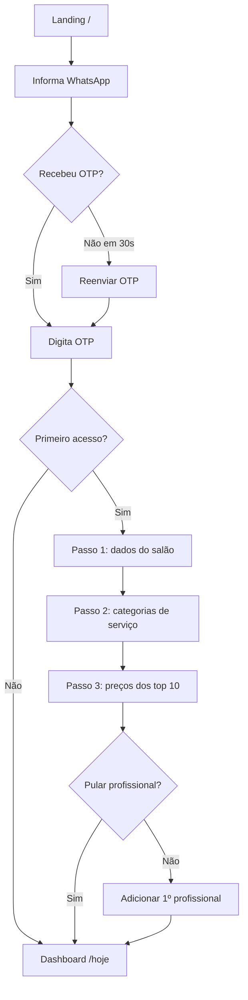

# SoftHair Front-End Specification

**Versão:** 1.0 (DRAFT — aguardando review)
**Data:** 2026-04-20
**Autora:** Uma (UX-Design Expert Agent)
**Status:** Draft para review do founder
**Inputs:** `docs/prd.md` v1.0 + `docs/architecture.md` v1.1 + `docs/brief.md` v1.0
**Metodologia:** Atomic Design (Brad Frost) + User-Centered Design (Sally)

---

## Introduction

Este documento define a especificação completa de front-end de **SoftHair** — o "como" visual e interacional do produto que o PRD descreveu em termos funcionais e que o architecture document descreveu em termos técnicos. O objetivo é entregar aos agentes `@dev` e às ferramentas de AI (v0, Lovable) tudo que precisam para implementar a UI sem ambiguidade.

A filosofia é **anti-fricção radical** — cada microinteração é projetada para reduzir esforço cognitivo e motor. O produto compete com incumbentes (Trinks, Avec) cuja UX é percebida como "complicada" em reviews; a aposta do SoftHair é **clareza e velocidade** como moat experiencial.

### Change Log

| Date | Version | Description | Author |
|---|---|---|---|
| 2026-04-20 | 1.0 | Draft inicial derivado do PRD v1.0 + architecture v1.1 | Uma (UX-Design) |

---

## Design Principles

Princípios norteadores para qualquer decisão de UI:

1. **Velocidade > Beleza:** se tiver que escolher, prioriza fluxo rápido. Beleza vem da consistência, não de decoração.
2. **Mobile-first, sempre:** toda feature é desenhada primeiro para 375×812 (iPhone SE/mini). Desktop é evolução, não origem.
3. **Anti-fricção radical:** cada clique é custo. Se uma ação pode ser automática, ela é. Se não pode, é 1-click.
4. **Clareza sobre cleverness:** labels diretos, copy sem jargão, estados visíveis. Nenhum mistério.
5. **Feedback imediato:** toda ação tem resposta visual em <200ms (skeleton, loading, toast, optimistic UI).
6. **Acessível por padrão:** WCAG 2.1 AA é o mínimo, não meta. Contraste, teclado, screen reader funcionando em 100% das telas.
7. **Sistema, não página:** usamos atomic design — nada é one-off. Se precisa de um novo padrão, vira atom/molecule reutilizável.

---

## Target Personas

### Persona 1: Camila — Dona do Salão (primary user)

![Persona card — texto descritivo abaixo]

- **Idade:** 38 anos
- **Contexto:** Dona de salão em bairro de classe média de capital (ex. Pinheiros-SP), 4 profissionais + 1 recepcionista, faturamento R$ 60K/mês
- **Jornada digital atual:** agenda em caderno duplicada numa planilha quando lembra, WhatsApp pessoal para confirmação, Excel no fim do mês para comissão. Já tentou Trinks (complicado e caro pelo add-on de NFS-e) e desistiu.
- **Tech comfort:** intermediário — usa Instagram Business, WhatsApp, e-banking, Uber. Não tem paciência para tutoriais longos.
- **Tempo disponível para aprender:** ~30min na primeira tentativa. Se não funcionar rápido, abandona.
- **Dispositivo principal:** iPhone (60%), notebook compartilhado com recepção (40%)
- **Dor #1:** recepcionista erra confirmação e cliente não aparece
- **Dor #2:** final do mês é tortura para fechar comissão sem conflito com profissionais
- **Sonho:** "Eu queria só olhar uma tela de manhã e saber tudo que vai acontecer hoje"

**Empathy snapshot:**
- **Says:** "Se eu tivesse que escolher entre o caderno e um sistema complicado, fico com o caderno"
- **Thinks:** "Não tenho tempo para treinar o time num sistema novo"
- **Does:** abre o app 20+ vezes por dia durante o expediente
- **Feels:** ansiosa com no-show recorrente; frustrada com ferramentas que prometem mas não entregam

### Persona 2: Beatriz — Cliente Final do Salão (secondary user)

- **Idade:** 31 anos
- **Contexto:** profissional que trabalha em escritório, vai ao salão 1-2x/mês (corte + hidratação)
- **Jornada atual:** manda "oi, tem horário terça?" no WhatsApp do salão, espera resposta (pode levar horas). Quando recebe confirmação, esquece. Recebe lembrete manual ou não recebe. Às vezes não aparece.
- **Tech comfort:** avançado — usa todos os apps modernos
- **Canal preferido de comunicação:** WhatsApp (>80% das conversas do dia)
- **Resistência a novos apps:** altíssima. Não baixa app de estabelecimento individual.
- **Dispositivo:** iPhone, sempre mobile
- **Dor #1:** demora pra confirmar horário quando manda fora de horário comercial
- **Dor #2:** não sabe o que o salão tem de disponibilidade — chuta e espera
- **Sonho:** "Queria só clicar num link e marcar em 30 segundos, do tipo Uber"

**Empathy snapshot:**
- **Says:** "Se tiver que baixar app, esqueci"
- **Thinks:** "Por que é tão difícil marcar no salão como é fácil pedir iFood?"
- **Does:** usa link do Instagram bio para quase tudo
- **Feels:** impaciente com demora; valoriza salões que respeitam o tempo dela

---

## Information Architecture

### Sitemap

```
SoftHair
├── Público (sem login)
│   ├── / (landing + CTA cadastro do salão)
│   ├── /login (magic link WhatsApp)
│   ├── /otp (verificação código)
│   ├── /{salon-slug}/{professional-slug} (link público de agendamento)
│   ├── /agendamento/{cancel-token} (gerenciamento do cliente final)
│   └── /indica/{referral-token} (landing de indicação)
│
├── Dashboard (autenticado — dono/recepcionista)
│   ├── /hoje (tela inicial — visão do dia)
│   ├── /agenda (visualização dia/semana/mês)
│   ├── /clientes
│   │   ├── /clientes (listagem)
│   │   └── /clientes/:id (detalhe)
│   ├── /profissionais
│   │   ├── /profissionais (listagem)
│   │   └── /profissionais/:id (perfil editável)
│   ├── /servicos
│   ├── /financeiro
│   │   ├── /financeiro (dashboard)
│   │   ├── /financeiro/comissao (relatório mensal)
│   │   └── /financeiro/nfse (NFS-e emitidas)
│   ├── /indicacao (dashboard de indicações + config)
│   └── /configuracoes
│       ├── /configuracoes/salao
│       ├── /configuracoes/usuarios
│       ├── /configuracoes/whatsapp (templates)
│       ├── /configuracoes/indicacao
│       └── /configuracoes/assinatura
│
└── Onboarding (autenticado, primeira vez)
    └── /onboarding (wizard 3 passos)
```

### Navegação primária

**Desktop (>= 1024px):** Sidebar fixa à esquerda (240px width) com:
- Logo SoftHair (topo)
- Avatar + nome do salão (embaixo do logo)
- 8 itens de menu: Hoje, Agenda, Clientes, Profissionais, Serviços, Financeiro, Indicação, Configurações
- Menu do usuário (avatar bottom-left) com: Mudar de salão (futuro), Sair

**Mobile (< 1024px):** Bottom navigation fixa com 5 itens primários:
- Hoje, Agenda, Clientes, Financeiro, Mais (hamburger com demais itens)

### URL Conventions

- Português nas URLs públicas (voltado ao usuário final): `/agenda`, `/clientes`, `/hoje`
- Inglês em APIs e tokens: `/api/public/book`, `/agendamento/{cancel-token}`
- Kebab-case sempre
- Slugs auto-gerados (sem acentos, sem espaços)

---

## Critical User Flows

### Flow 1 — Onboarding do Salão (Epic 1)

**Persona:** Camila (dono do salão)
**Goal:** De "zero" até agenda funcional em <10min
**Entry point:** Landing `/` → click "Criar conta grátis"



**Estados críticos:**
- OTP recebido: template "🔒 Seu código SoftHair: 123456 (válido por 10min)"
- Após wizard: onboarding banner persistente "3 passos para receber seu 1º agendamento" (mostra até completar)
- Se usuário fecha wizard no meio: retomada no passo onde parou

**Timeouts / edge cases:**
- OTP expira em 10min → mensagem amigável + botão reenviar
- Tentativa > 3 de OTP em 10min → bloqueio de 30min
- Wizard "Pular e configurar depois" sempre disponível (minimiza abandono)

### Flow 2 — Self-Booking do Cliente Final (Epic 2)

**Persona:** Beatriz (cliente final)
**Goal:** Agendar via link público em ≤ 60 segundos
**Entry point:** Link no Instagram bio / WhatsApp status

```mermaid
flowchart TD
    Start[Acessa link público] --> ProPage[Página do profissional com fotos/serviços]
    ProPage --> SelectService[Seleciona serviço]
    SelectService --> SelectDateTime[Escolhe data + horário disponível]
    SelectDateTime --> FillContact[Informa nome + WhatsApp + consent LGPD]
    FillContact --> Validate{Válido?}
    Validate -->|Não| ShowError[Mostra erro específico]
    ShowError --> FillContact
    Validate -->|Sim| Submit[Submete]
    Submit --> Success[Tela de sucesso + "próximos passos"]
    Success --> WhatsAppConfirm[Aguarda confirmação WhatsApp 24h antes]
```

**Estados críticos:**
- Slots disponíveis atualizados em realtime (se outro cliente agendar ao mesmo tempo, UI mostra "horário já foi preenchido, escolha outro")
- Validação progressiva (telefone formata enquanto digita)
- Consent LGPD é link discreto mas obrigatório — não é pop-up agressivo

**Anti-fricção:**
- Nenhuma tela de "criar conta"
- Nenhuma senha
- Telefone é a identidade (reuso em retornos futuros via link único)
- Tela de sucesso imediata — confirmação vem depois por WhatsApp

### Flow 3 — Dashboard "Hoje" (recorrente, 20+ vezes/dia)

**Persona:** Camila (dono/recepcionista)
**Goal:** Saber o que está acontecendo agora em < 5 segundos
**Entry point:** Login → landing default é `/hoje`

```mermaid
flowchart TD
    Login[Já logado] --> HojePage[/hoje]
    HojePage --> Scan[Escaneia 3 cards topo]
    Scan --> Alert{Tem alerta?}
    Alert -->|Sim| AlertAction[Clica no alerta → ação corretiva]
    Alert -->|Não| AppointmentList[Lista de agendamentos do dia]
    AppointmentList --> QuickAction{Precisa agir?}
    QuickAction -->|Confirmar manual| MarkConfirmed[Long-press → confirmar]
    QuickAction -->|Cancelar| SwipeCancel[Swipe left → cancelar]
    QuickAction -->|Atendimento feito| SwipeComplete[Swipe right → marcar feito]
    QuickAction -->|Nenhum| Close[Fecha app / muda tela]
```

**Conteúdo da tela /hoje:**
- **Header:** data por extenso + saudação ("Bom dia, Camila 👋")
- **3 métricas em cards grandes:** Agendamentos hoje / Faturamento previsto / Ocupação (%)
- **Alertas** (quando houver): "🔴 1 cliente sem confirmar", "⚠️ Produto em falta", "✨ 2 indicações confirmadas este mês"
- **Lista de agendamentos** ordenada por horário: cada card mostra hora, cliente, profissional, serviço, status (CONFIRMED/PENDING/COMPLETED)
- **FAB "+" flutuante** (mobile) → novo agendamento manual

---

## Design System Foundations

### Color Tokens

**Filosofia:** base warm-neutral (stone) + accent vibrante violeta + semânticos funcionais. Zero cores hardcoded — tudo via tokens.

#### Neutrals (Stone family)

| Token | Hex | Uso |
|---|---|---|
| `--color-bg` | `#FAFAF9` | Background page (stone-50) |
| `--color-surface` | `#FFFFFF` | Cards, modais |
| `--color-surface-hover` | `#F5F5F4` | Hover de cards (stone-100) |
| `--color-border` | `#E7E5E4` | Divisores, borders sutis (stone-200) |
| `--color-border-strong` | `#D6D3D1` | Borders visíveis (stone-300) |
| `--color-text-muted` | `#78716C` | Text secundário (stone-500) |
| `--color-text-base` | `#44403C` | Text padrão (stone-700) |
| `--color-text-strong` | `#1C1917` | Títulos, ênfase (stone-900) |

#### Accent (Violet — brand color)

| Token | Hex | Uso |
|---|---|---|
| `--color-accent-50` | `#F5F3FF` | Background de chips/badges |
| `--color-accent-100` | `#EDE9FE` | Hover de items accent |
| `--color-accent-500` | `#8B5CF6` | Accent default |
| `--color-accent-600` | `#7C3AED` | **Primary action** (CTA buttons) |
| `--color-accent-700` | `#6D28D9` | Pressed state |
| `--color-accent-900` | `#4C1D95` | Text em fundo accent claro |

#### Semantic

| Token | Hex | Uso |
|---|---|---|
| `--color-success` | `#10B981` | Success states (emerald-500) |
| `--color-success-bg` | `#ECFDF5` | Background de toast sucesso |
| `--color-error` | `#EF4444` | Error states (red-500) |
| `--color-error-bg` | `#FEF2F2` | Background de toast erro |
| `--color-warning` | `#F59E0B` | Warning states (amber-500) |
| `--color-warning-bg` | `#FFFBEB` | Background de toast warning |
| `--color-info` | `#0EA5E9` | Info states (sky-500) |
| `--color-info-bg` | `#F0F9FF` | Background de toast info |

#### Status de agendamento (usa semantics + nuances)

| Token | Hex | Uso |
|---|---|---|
| `--status-pending` | `#F59E0B` | Pending confirmation (âmbar) |
| `--status-confirmed` | `#10B981` | Confirmed (verde) |
| `--status-completed` | `#7C3AED` | Completed (accent — celebração) |
| `--status-no-show` | `#EF4444` | No-show (vermelho) |
| `--status-canceled` | `#78716C` | Canceled (neutro) |

#### Contrast validation

Todos os pares texto-fundo acima atingem **WCAG 2.1 AA** (ratio ≥ 4.5:1 para texto regular, ≥ 3:1 para large text e elementos UI). Validação automatizada via `axe-core` no CI.

### Typography

**Fonts:**
- **Sans:** Inter (variável, pesos 400/500/600/700) — UI, body, labels
- **Display:** Playfair Display (pesos 400/600) — headlines seletivas (landing, empty states)

Ambas via `next/font/google` (zero FOUT, preload automático).

**Escala modular (ratio 1.25):**

| Token | Size | Line-height | Uso |
|---|---|---|---|
| `--text-xs` | 12px | 16px | Labels, metadata, tags |
| `--text-sm` | 14px | 20px | Body pequeno, inputs |
| `--text-base` | 16px | 24px | Body padrão |
| `--text-lg` | 18px | 28px | Body destacado |
| `--text-xl` | 20px | 28px | Títulos de card |
| `--text-2xl` | 24px | 32px | Títulos de tela (mobile) |
| `--text-3xl` | 30px | 36px | Títulos de tela (desktop) |
| `--text-4xl` | 36px | 40px | Hero titles (display, landing) |
| `--text-5xl` | 48px | 1 | Display (rare) |

**Weights:**
- `400` regular (body)
- `500` medium (labels, buttons secondary)
- `600` semibold (buttons primary, títulos)
- `700` bold (rare — ênfase forte)

### Spacing (base 4px)

| Token | Value | Uso |
|---|---|---|
| `--space-0` | 0 | — |
| `--space-1` | 4px | Micro spacing (entre ícone e texto) |
| `--space-2` | 8px | Pequeno (dentro de chip) |
| `--space-3` | 12px | Pequeno-médio |
| `--space-4` | 16px | Padrão (padding de cards) |
| `--space-5` | 20px | — |
| `--space-6` | 24px | Entre seções |
| `--space-8` | 32px | Blocos grandes |
| `--space-10` | 40px | — |
| `--space-12` | 48px | Espaçamento hero |
| `--space-16` | 64px | Macro |

### Border Radius

| Token | Value | Uso |
|---|---|---|
| `--radius-none` | 0 | Dividers, inputs legacy |
| `--radius-sm` | 4px | Badges, tags |
| `--radius-md` | 8px | Inputs, buttons |
| `--radius-lg` | 12px | Cards |
| `--radius-xl` | 16px | Modais, cards grandes |
| `--radius-full` | 9999px | Avatars, chips |

### Elevation (shadows)

Sutis — só 3 níveis. Forma clara > forma pesada.

| Token | Box-shadow | Uso |
|---|---|---|
| `--shadow-sm` | `0 1px 2px rgba(28, 25, 23, 0.04)` | Cards estáticos |
| `--shadow-md` | `0 4px 6px -1px rgba(28, 25, 23, 0.06), 0 2px 4px -1px rgba(28, 25, 23, 0.04)` | Dropdown, menus |
| `--shadow-lg` | `0 10px 15px -3px rgba(28, 25, 23, 0.08), 0 4px 6px -2px rgba(28, 25, 23, 0.04)` | Modais, popovers |

### Motion

**Durations:**
- `--motion-instant` — 50ms (hover, focus)
- `--motion-fast` — 150ms (toggles, simple transitions)
- `--motion-base` — 250ms (modal open/close, drawer)
- `--motion-slow` — 400ms (page transitions)

**Easings:**
- `--ease-out` — `cubic-bezier(0.16, 1, 0.3, 1)` (entradas — rápido, desacelera)
- `--ease-in-out` — `cubic-bezier(0.4, 0, 0.2, 1)` (transições internas)
- `--ease-bounce` — `cubic-bezier(0.68, -0.55, 0.265, 1.55)` (raro — confetti pós-ação celebrativa)

**Respect `prefers-reduced-motion`:** todas as animações têm fallback para `animation-duration: 0ms` quando o usuário preferir.

### Iconography

- **Library:** Lucide React (outline, 24×24 default)
- **Sizes:** 16px (inline em texto), 20px (padrão), 24px (destacado), 32px (feature icons)
- **Stroke width:** 1.5px (padrão Lucide)
- **Color:** herda do contexto (`currentColor`)

### Grid & Breakpoints

**Breakpoints (mobile-first):**

| Token | Min-width | Target |
|---|---|---|
| `sm` | 640px | Phone landscape / small tablet |
| `md` | 768px | Tablet portrait |
| `lg` | 1024px | Tablet landscape / laptop pequeno |
| `xl` | 1280px | Desktop |
| `2xl` | 1536px | Desktop large |

**Grid:**
- Mobile: padding horizontal `--space-4` (16px)
- Tablet: padding horizontal `--space-6` (24px)
- Desktop: max-width 1280px centralizado, padding `--space-8` (32px)
- Gap vertical consistente entre seções: `--space-6` (mobile) / `--space-8` (desktop)

---

## Atomic Component Catalog

Catálogo organizado por níveis de Atomic Design. Cada componente tem: propósito, variantes, estados, specs de token, considerações de acessibilidade.

### Atoms

#### `Button`

**Variants:** `primary` (accent), `secondary` (neutral ghost), `danger` (red), `ghost` (transparent)
**Sizes:** `sm` (32px), `md` (40px — default), `lg` (48px — full-width CTAs)
**States:** default, hover, active, focus, loading, disabled
**Tokens usados:**
- `primary`: bg=`--color-accent-600`, hover=`--color-accent-700`, text=white
- `secondary`: bg=`--color-surface`, border=`--color-border-strong`, text=`--color-text-base`
- Padding: `--space-4` horizontal, `--space-2` vertical
- Radius: `--radius-md`
**Accessibility:**
- Focus ring visível: 2px offset, cor `--color-accent-500`
- Loading state: spinner + aria-live="polite" anunciando "Carregando"
- Disabled: `aria-disabled="true"`, cursor not-allowed

#### `Input`

**Variants:** `text`, `phone` (formatação E.164 BR), `email`, `number`, `password`, `textarea`
**States:** default, focus, error, disabled
**Tokens:**
- Height: 40px (md), 48px (lg)
- Padding: `--space-3` horizontal
- Border: `--color-border` → focus `--color-accent-500` → error `--color-error`
- Radius: `--radius-md`
**Accessibility:**
- Label sempre visível (nunca placeholder-only)
- `aria-invalid="true"` quando erro
- Helper text com `aria-describedby`

#### `Select` / `Combobox`

Baseado em Radix Select (via shadcn/ui).
**States:** idem Input
**Keyboard:** Tab, Space/Enter open, arrows navigate, Esc close
**Accessibility:** `role="combobox"`, `aria-expanded`, `aria-activedescendant`

#### `Badge`

**Variants:** `default` (neutral), `success`, `warning`, `error`, `info`, `accent`
**Sizes:** `sm` (20px), `md` (24px)
**Uso:** status de agendamento, contadores, tags
**Tokens:** bg=`--color-{semantic}-bg`, text=`--color-{semantic}`, radius=`--radius-full`

#### `Avatar`

**Sizes:** `xs` (24), `sm` (32), `md` (40), `lg` (48), `xl` (64)
**Fallback:** iniciais do nome (1ª letra de primeiro + último nome) em bg `--color-accent-100`, text `--color-accent-700`
**Accessibility:** `alt` descritivo quando foto; `aria-label` com nome completo quando iniciais

#### `Label`

Componente tipográfico para labels de formulário.
**Specs:** `--text-sm`, `font-weight: 500`, color `--color-text-strong`, margin-bottom `--space-1`

#### `Icon`

Wrapper para Lucide. Aceita `size` prop (16/20/24/32) e `color` (herda por padrão).
**Accessibility:** `aria-hidden="true"` quando decorativo; `role="img"` + `aria-label` quando informativo.

#### `Toast`

**Types:** success, error, warning, info
**Position:** bottom-center (mobile), bottom-right (desktop)
**Duration:** 4s default, 6s para errors
**Tokens:** bg `--color-{type}-bg`, border `--color-{type}`, icon `--color-{type}`
**Accessibility:** `role="status"` (success/info) ou `role="alert"` (error), dismissable via Esc

### Molecules

#### `FormField`

Composição: `Label` + `Input` (ou Select/Textarea) + `HelperText` (opcional) + `ErrorMessage` (condicional).
**Uso:** todos os forms do sistema.

#### `SearchBar`

`Input` com ícone search à esquerda + clear button à direita quando preenchido.
**Behavior:** debounce 250ms, submit on enter, clear on Esc.

#### `TimeSlot`

Card clicável representando um horário disponível no fluxo de booking.
**States:** available, selected, unavailable (disabled)
**Tokens:** available=`--color-surface` border `--color-border`; selected=`--color-accent-50` border `--color-accent-600`; unavailable=`--color-surface-hover` text-muted
**Accessibility:** `role="radio"`, grupo `role="radiogroup"` com `aria-label="Selecione um horário"`

#### `ServiceCard`

Card compacto com nome, duração, preço do serviço.
**Variants:** `selectable` (cliente escolhendo), `editable` (dono configurando)
**Accessibility:** `role="button"` quando selectable, keyboard activation

#### `ClientCard`

Card de cliente (listagem /clientes). Mostra avatar, nome, telefone, último serviço, saldo de crédito (se > 0).
**Affordances:**
- Desktop: click abre detalhe, icon menu (`MoreVertical`) com ações
- Mobile: swipe-left revela "Ligar/WhatsApp/Excluir"

#### `AppointmentCard`

**Conteúdo:** horário, cliente, serviço, profissional, badge de status
**Variants:** `hoje` (compacto, na lista /hoje), `agenda` (bloco visual na grid de calendário), `detail` (modal completo com ações)
**Interactions (mobile):**
- Tap → abre modal de detalhe
- Long-press → menu de ação rápida (Confirmar, Cancelar, Remarcar)
- Swipe-right → marcar como `COMPLETED` (com confirmação)
- Swipe-left → cancelar (com confirmação)
**Interactions (desktop):**
- Click → modal de detalhe
- Drag-and-drop (na agenda grid) → reagendamento visual

#### `OTPInput`

6 inputs de 1 dígito unificados visualmente. Auto-focus no próximo, paste suporta código completo, backspace volta.
**Accessibility:** `aria-label="Código de 6 dígitos"`, `autocomplete="one-time-code"`

### Organisms

#### `SidebarNav` (desktop)

Navigation lateral fixa com items + active state + avatar do usuário no rodapé.
**States:** expanded (padrão), collapsed (icon-only — futuro, Phase 2)
**Active indicator:** barra vertical esquerda `--color-accent-600` + fundo `--color-accent-50`
**Accessibility:** `<nav aria-label="Principal">`

#### `BottomNav` (mobile)

5 items fixos na parte inferior da tela.
**Height:** 56px + safe-area
**Active state:** ícone preenchido + text `--color-accent-600`
**Accessibility:** `<nav aria-label="Principal">`, cada item `aria-current="page"` quando ativo

#### `Header`

Top bar em páginas públicas (landing, link de agendamento). Logo + nav minimal.

#### `CalendarView`

Grid visual da agenda (Day/Week/Month view).
**Features:**
- Linha horizontal indicando hora atual (updates realtime a cada 1min)
- Drag-and-drop de `AppointmentCard` entre slots
- Resize vertical de card = mudar duração
- Click em slot vazio = abre fluxo "novo agendamento"
**Performance:** virtualization em view "Month" (renderiza apenas células visíveis)

#### `OnboardingStep`

Container genérico dos passos do wizard:
- Barra de progresso (1/3, 2/3, 3/3)
- Título do passo
- Conteúdo (form)
- Botões: "Voltar" (esquerda), "Pular" (centro, opcional), "Próximo/Finalizar" (direita)

#### `PublicBookingFlow`

Organismo completo do fluxo de booking público (Flow 2). 3 passos numa única página com stepper visual.

#### `DashboardTodayCard`

Card das 3 métricas principais em `/hoje`:
- Valor grande (text-3xl, accent color se positivo, muted se zero)
- Label pequeno (text-sm muted)
- Comparação com período anterior (se aplicável) em text-xs

#### `EmptyState`

Usado quando listagem vazia.
**Conteúdo:**
- Ícone decorativo (stroke cinza, 48px)
- Título (text-lg)
- Descrição (text-sm, muted)
- CTA primário (opcional)
**Tokens:** padding `--space-12`, alignment center

### Templates

#### `DashboardLayout`

Composição: `SidebarNav` (desktop) / `BottomNav` (mobile) + area de conteúdo com max-width 1280px + opcional `PageHeader` (title + ações).

#### `PublicLayout`

Composição: `Header` minimal + main content full-width (otimizado para conversão) + footer legal (LGPD links).

#### `AuthLayout`

Composição centralizada vertical + horizontal: logo topo, card de formulário (max-width 400px), links abaixo.

#### `WizardLayout`

Full-screen com header minimal + barra de progresso + container centralizado do passo atual.

### Pages (instances)

Cada uma das 13 telas do PRD é uma instance de um Template acima composto com os Organisms/Molecules específicos.

---

## Wireframes (Low-Fi) — Telas Prioritárias

Descrições em ASCII para as 6 telas mais críticas. Alta-fi fica por conta do `@dev` via v0/Lovable usando os tokens e componentes acima.

### 1. `/hoje` (Dashboard Today — mobile)

```
┌──────────────────────────────────────┐
│ 👤 Camila • Salão Bellezza      ⋮   │
│ Segunda, 20 de abril                 │
│ Bom dia, Camila 👋                   │
├──────────────────────────────────────┤
│ ┌──────┐ ┌──────┐ ┌──────┐          │
│ │  12  │ │ R$   │ │ 85%  │          │
│ │agend.│ │1.840 │ │ocup. │          │
│ └──────┘ └──────┘ └──────┘          │
│                                      │
│ 🔴 1 cliente sem confirmar          │
│                                      │
│ PRÓXIMOS                             │
│ ┌──────────────────────────────────┐│
│ │ 09:00 • Beatriz S.         🟡   ││
│ │ Corte + Hidratação — Paula      ││
│ └──────────────────────────────────┘│
│ ┌──────────────────────────────────┐│
│ │ 10:30 • Fernanda T.        🟢   ││
│ │ Coloração — Paula               ││
│ └──────────────────────────────────┘│
│ ┌──────────────────────────────────┐│
│ │ 11:00 • Helena M.          🟢   ││
│ │ Manicure — Bruna                ││
│ └──────────────────────────────────┘│
│ ...                                  │
├──────────────────────────────────────┤
│ [Hoje] [Agenda] [Clientes] [Fin] [⋯]│
└──────────────────────────────────────┘
                                    (+)
```

### 2. `/agenda` (Week view — mobile)

```
┌──────────────────────────────────────┐
│ ← Abril 2026                   🔽   │
│ [Dia] [Semana*] [Mês]               │
├──────┬───────┬───────┬───────┬──────┤
│      │ Seg 20│ Ter 21│ Qua 22│ ... │
│ 08h  │       │       │       │     │
│ 09h  │ ▓▓▓   │       │ ▓▓    │     │
│ 10h  │ ▓▓▓   │ ▓     │       │     │
│ 11h  │ ▓     │       │ ▓▓▓   │     │
│ 12h  │───── almoço ────────────    │
│ 14h  │ ▓▓    │ ▓▓    │       │     │
│ ...                                  │
├──────────────────────────────────────┤
│ [Hoje] [Agenda*] [Clientes] [Fin] [⋯]│
└──────────────────────────────────────┘
                                    (+)
```

- Cada ▓ é um `AppointmentCard` compacto (cor por status)
- Swipe horizontal navega entre semanas
- Pinch-zoom aumenta altura dos slots

### 3. Link público `/{salon}/{professional}` (mobile)

```
┌──────────────────────────────────────┐
│          SALÃO BELLEZZA             │
│           ──────────                 │
│                                      │
│         ┌─────────┐                 │
│         │  FOTO   │                 │
│         │  PAULA  │                 │
│         └─────────┘                 │
│         Paula Silva                  │
│     ⭐ Cabeleireira sênior           │
│                                      │
│   "12 anos de experiência em         │
│    coloração e cortes modernos"      │
│                                      │
│  [       AGENDAR AGORA       ]      │
│                                      │
│  SERVIÇOS                            │
│  ┌─────────────────────┐            │
│  │ Corte feminino      │            │
│  │ 45min • R$ 80      ›│            │
│  └─────────────────────┘            │
│  ┌─────────────────────┐            │
│  │ Coloração           │            │
│  │ 2h • R$ 180        ›│            │
│  └─────────────────────┘            │
│  ...                                 │
│                                      │
│  Powered by SoftHair                 │
└──────────────────────────────────────┘
```

### 4. Fluxo de booking público — Passo 2/3 (mobile)

```
┌──────────────────────────────────────┐
│ ← Agendar com Paula                  │
│ ●──●──○  Serviço: Corte feminino    │
├──────────────────────────────────────┤
│ ESCOLHA DATA E HORÁRIO               │
│                                      │
│ Seg 20  Ter 21  Qua 22  Qui 23  ... │
│  ●                                   │
│                                      │
│ Horários disponíveis — Seg, 20/abr: │
│                                      │
│  ┌────┐ ┌────┐ ┌────┐ ┌────┐        │
│  │9:00│ │9:45│ │10:30│ │14:00│      │
│  └────┘ └────┘ └────┘ └────┘        │
│  ┌────┐ ┌────┐                      │
│  │15:15│ │16:00│                    │
│  └────┘ └────┘                      │
│                                      │
│ Horários indisponíveis em cinza      │
│                                      │
│  [      CONTINUAR      ]            │
└──────────────────────────────────────┘
```

### 5. Detalhe de Cliente (desktop)

```
┌────────────┬─────────────────────────────────────┐
│ SIDEBAR    │ ← Clientes                          │
│            │                                     │
│ ✓ Hoje     │  ┌─────────┐ Beatriz Silva         │
│   Agenda   │  │ FOTO    │ (11) 98765-4321       │
│ ✓ Clientes │  │         │ ✨ Crédito: R$ 20     │
│   Profiss. │  └─────────┘ Cliente desde ago/25 │
│   Serviços │                                     │
│   Financ.  │  PRÓXIMOS AGENDAMENTOS              │
│   Config.  │  ┌───────────────────────────────┐ │
│            │  │ 22/abr 14h • Corte • Paula    │ │
│            │  └───────────────────────────────┘ │
│            │                                     │
│            │  HISTÓRICO                          │
│            │  ┌───────────────────────────────┐ │
│            │  │ 15/mar • Corte+Hidratação     │ │
│            │  │ Paula • R$ 140 • ⭐⭐⭐⭐⭐   │ │
│            │  └───────────────────────────────┘ │
│            │  ...                                │
│            │                                     │
│            │  OBSERVAÇÕES                        │
│            │  [Prefere cortes desconectados…]   │
│            │                                     │
│            │  INDICAÇÕES                         │
│            │  2 indicadas • 1 ativa • R$20 crédito│
│            │                                     │
│            │  [EDITAR] [EXCLUIR]                 │
│ [Camila ⚙]│                                     │
└────────────┴─────────────────────────────────────┘
```

### 6. Financeiro — Dashboard (desktop)

```
┌────────────┬─────────────────────────────────────┐
│ SIDEBAR    │ FINANCEIRO          [Este mês ▾]   │
│            │                                     │
│            │  ┌──────────┐ ┌──────────┐ ┌──────┐│
│            │  │ R$ 48K   │ │ 142      │ │ 5%  ││
│            │  │ Faturam. │ │ atendim. │ │ vs│││
│            │  │ mês      │ │ realiz.  │ │ ant ││
│            │  └──────────┘ └──────────┘ └──────┘│
│            │                                     │
│            │  FATURAMENTO — ÚLTIMOS 30 DIAS      │
│            │  ┌───────────────────────────────┐ │
│            │  │ [GRÁFICO DE LINHA AREA]       │ │
│            │  │                                │ │
│            │  └───────────────────────────────┘ │
│            │                                     │
│            │  ┌─────────────┬─────────────────┐ │
│            │  │ POR PROFISS │ POR SERVIÇO     │ │
│            │  │ ██ Paula 42%│ ██ Corte 35%    │ │
│            │  │ ██ Bruna 30%│ ██ Colorac. 28% │ │
│            │  │ ██ Juli  28%│ ██ Manicure 20% │ │
│            │  └─────────────┴─────────────────┘ │
│            │                                     │
│            │  [Ver comissão] [NFS-e emitidas]   │
└────────────┴─────────────────────────────────────┘
```

---

## Interaction Patterns

### Magic Link WhatsApp (login)

- Input único de telefone com máscara automática (`(11) 98765-4321`)
- CTA primário "Receber código"
- Após envio: tela de OTP com 6 inputs separados, paste-friendly, auto-advance
- Timer visível "Reenviar código em 30s"
- Erro de OTP inválido: shake animation sutil + mensagem específica
- 3 tentativas erradas: bloqueio 30min com explicação clara

### Drag-and-drop da agenda

- Cursor muda para "grab" ao passar sobre `AppointmentCard`
- Durante drag: card ganha `--shadow-lg`, opacity 0.8, cursor "grabbing"
- Slots válidos para drop: highlight com `--color-accent-50`
- Slots inválidos (conflito): highlight com `--color-error-bg` + cursor "not-allowed"
- Drop bem-sucedido: `--motion-base` animation + toast "Reagendado para {horário}"
- Undo disponível por 5s no toast

### Swipe actions mobile

- Swipe-right em `AppointmentCard`: revela "✓ Concluído" (green bg)
- Swipe-left: revela "⚠ Cancelar" (red bg) + "Reagendar" (amber bg)
- Threshold: 30% da largura do card para acionar
- Haptic feedback ao cruzar threshold (vibration API)
- Confirmação em toast com Undo

### Optimistic UI

Operações rápidas (mudança de status, cancelamento, aplicação de crédito) atualizam UI imediatamente, mesmo antes da confirmação do servidor. Se falhar: revert + toast com explicação + retry.

### PWA install prompt

- Aparece automaticamente após 3 visitas OU ao completar onboarding
- Banner não-intrusivo no rodapé (mobile) / top (desktop)
- CTA "Instalar SoftHair" + botão "Agora não" sempre visível
- Dismissable persistente (não aparece mais por 30 dias após dismiss)

### Realtime updates

- Novos agendamentos aparecem com fade-in `--motion-base`
- Updates de status: card pulsa sutilmente + badge muda com crossfade
- Sem notificação sonora (respeita contexto profissional)

---

## Accessibility Specification (WCAG 2.1 AA)

### Hard requirements (bloqueia deploy se falhar)

1. **Contrast ratio:** texto regular ≥ 4.5:1; texto large (≥18px ou ≥14px bold) ≥ 3:1; elementos UI (bordas de input focáveis, ícones) ≥ 3:1
2. **Keyboard navigation:** todo elemento interativo acessível via Tab; Esc fecha modais/dropdowns; Enter/Space ativam botões
3. **Focus visible:** ring `2px --color-accent-500` com offset `2px`; nunca remover com `outline: none` sem alternativa
4. **Screen reader compatibility:** todos os ícones decorativos com `aria-hidden`; ícones informativos com `aria-label`; forms com labels associados
5. **Form errors:** mensagens específicas + `aria-invalid="true"` + `aria-describedby` para helper
6. **Dynamic content:** `role="status"` ou `role="alert"` para toasts e updates críticos
7. **Heading structure:** 1 `<h1>` por página; hierarquia sem pulos
8. **Language:** `<html lang="pt-BR">` em todas as páginas
9. **Reduced motion:** todas as animações respeitam `prefers-reduced-motion: reduce`

### Validação automatizada

- `axe-core` em Playwright E2E: falha bloqueia merge
- Lighthouse Accessibility ≥ 95 em Chrome DevTools CI

### Validação manual

- Smoke test com VoiceOver (iOS Safari) + TalkBack (Android Chrome) antes do design-partner #1
- Teste com navegação keyboard-only em todos os fluxos críticos

---

## Responsive Strategy

### Layout breakpoints

- `< sm (< 640px)`: Mobile vertical — bottom nav, stack vertical, padding reduzido
- `sm (≥ 640px)`: Mobile horizontal / tablet pequeno — ainda bottom nav, 2 colunas onde fizer sentido
- `md (≥ 768px)`: Tablet portrait — transição para sidebar colapsado (opcional, Phase 2), 3 colunas em listings
- `lg (≥ 1024px)`: **Desktop primário** — sidebar expandido, 3-4 colunas em listings
- `xl (≥ 1280px)`: Desktop amplo — max-width ativa, espaçamento maior
- `2xl (≥ 1536px)`: Max layout — sem mudanças além de whitespace

### Mobile-first rules

- Toda feature é desenhada primeiro no 375×812
- Desktop é "enhancement" — adiciona affordances, não redefine fluxos
- Touch targets: mínimo 44×44px (Apple HIG)
- Gestos (swipe, long-press, pinch) são complementares — sempre há alternativa click/tap

### Performance budget por viewport

| Viewport | Target Lighthouse Performance | LCP | TBT |
|---|---|---|---|
| Mobile (4G) | ≥ 85 | < 2.5s | < 300ms |
| Desktop | ≥ 90 | < 1.8s | < 200ms |

---

## PWA Specification

### Manifest

```json
{
  "name": "SoftHair",
  "short_name": "SoftHair",
  "description": "Gestão completa para salões de beleza",
  "start_url": "/hoje",
  "display": "standalone",
  "background_color": "#FAFAF9",
  "theme_color": "#7C3AED",
  "orientation": "portrait-primary",
  "icons": [
    { "src": "/icons/icon-192.png", "sizes": "192x192", "type": "image/png" },
    { "src": "/icons/icon-512.png", "sizes": "512x512", "type": "image/png" },
    { "src": "/icons/maskable-512.png", "sizes": "512x512", "type": "image/png", "purpose": "maskable" }
  ]
}
```

### Service Worker strategy

- Assets estáticos (JS, CSS, fontes): cache-first com fallback network
- HTML páginas: network-first com fallback cache (offline degrada gracefully)
- API calls: network-only (não queremos dados stale em contexto financeiro)
- Realtime channels: não cacheable (por definição)

### Offline states

- Tela "Você está offline" quando rota autenticada inacessível
- Read-only com última cache em /clientes, /servicos, /profissionais (dados não críticos)
- Banner persistente "Modo offline — algumas funções desabilitadas" quando navigator.onLine === false

---

## Handoff Specifications

### Para @dev (Dex)

Implementação deve seguir **Atomic Design strict**:

1. Instalar stack já definido em architecture (Next.js 15 + Tailwind v4 + shadcn/ui + Inter + Playfair)
2. Criar `packages/ui` com tokens em `globals.css` (CSS custom properties nomeados exatamente como neste doc)
3. Implementar atoms **antes** de molecules; molecules **antes** de organisms
4. Cada componente tem 3 arquivos: `component.tsx` + `component.test.tsx` + `component.stories.tsx` (opcional)
5. **Zero valores hardcoded** — apenas tokens via Tailwind + CSS vars
6. Seguir ordem de stories do PRD — Epic 1 (7 stories) gera os atoms + 1-2 molecules. Epic 2 gera organisms principais (CalendarView, AppointmentCard).

### Para AI UI tools (v0, Lovable, 21st.dev Magic)

Prompt base para geração:

> Design system: violet accent (`#7C3AED`) on stone-warm neutrals. Sans-serif Inter (UI) + Playfair Display (seletivo). Mobile-first PWA for Brazilian beauty salon SaaS. WCAG AA. Atomic Design. Use shadcn/ui as base. Reference design tokens in `docs/front-end-spec.md`. Avoid decorative imagery; favor clarity and speed.

### Para @architect (Aria) — feedback

1. **Validar design tokens** com seus preferences de stack (compatibilidade Tailwind v4 — CSS `@theme`)
2. **Estratégia de fonts:** confirmar `next/font` é suficiente ou se precisamos self-host (evitar dependência de Google Fonts em runtime)
3. **PWA service worker:** confirmar lib (`next-pwa` vs custom em App Router)

### Para @data-engineer (Dara) — requisitos UI-driven

1. **Queries otimizadas** para CalendarView (view/month com até 600 agendamentos) — pode precisar de materialized view
2. **Realtime throttling:** limitar updates push a 1/segundo por salão para evitar flood na UI

---

## Metrics & Success Criteria (UX)

### Quantitativas (medidas via PostHog/Vercel Analytics)

| Métrica | Target MVP | Como medir |
|---|---|---|
| Time to first booking (onboarding) | ≤ 10min | Evento `onboarding_completed` vs `signup_started` |
| Self-booking completion rate | ≥ 70% | `booking_completed` / `booking_started` |
| Self-booking time-on-task | ≤ 60s | Timestamp delta |
| Dashboard time-to-scan | ≤ 5s | Session replay sampling |
| Error rate em forms críticos | < 2% | Eventos de erro / submissions |
| Accessibility violations (axe) | 0 critical | CI gate |

### Qualitativas (medidas via pesquisa com design-partners)

- SUS score (System Usability Scale) ≥ 80
- NPS específico da UI ≥ 40
- Top 3 termos descritivos esperados: "rápido", "fácil", "bonito" (pesquisa aberta)

---

## Open Questions & Next Steps

### Questions pendentes

1. **Branding final:** logo, tom de voz de copy, nome oficial (SoftHair é working name — validar antes de design de landing)
2. **Fotografia do produto:** estratégia — stock photos? fotos reais dos design-partners? ilustrações? (impacto: landing + link público)
3. **Fluxo de profissional (Phase 2):** quais telas específicas ele precisa? (agenda filtrada, comissão acumulada, mais nada?)
4. **Multi-unit (Phase 3):** como UX muda quando dono tem 2+ salões? (preview rápido agora facilita decisão de dados no DDL)

### Ações imediatas (após review)

1. Founder valida este spec e aprova paleta + principles
2. Founder (ou designer externo) cria logo + identidade visual (fora do escopo deste doc)
3. **`*shard-doc docs/front-end-spec.md`** — quebra em `docs/front-end-spec/` para referência granular
4. Handoff formal ao **@data-engineer (Dara)** — criar DDL com considerações UI-driven desta seção
5. Handoff formal ao **@dev (Dex)** (via @sm criando stories) — implementar atoms primeiro, seguindo ordem do Epic 1

### Depois da Epic 1 estar implementada

- Primeiro teste de usabilidade com 3 donos de salão (protótipo clicável ou staging)
- Iteração em hot-fixes de UX antes do design-partner #1 formal
- Plano de testes A/B futuros (pricing display, CTA copy, etc.)

---

**SoftHair front-end spec v1.0 — ready for handoff.**

— Uma, desenhando com empatia 💝
